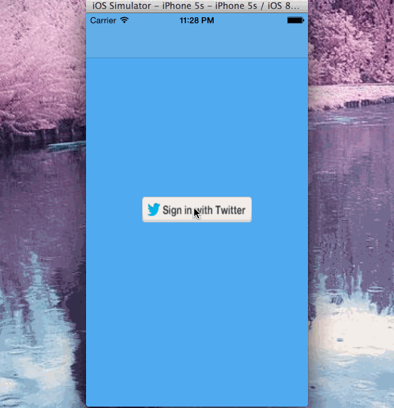

# Twitter Submission

This is a week 4 assignment for Yahoo iOS class building a Twitter client.

Time spent: 30 hours spent in total

Completed user stories:

 * [x] Required: User can sign in using OAuth login flow
 * [x] Required: User can view last 20 tweets from their home timeline
 * [x] Required: The current signed in user will be persisted across restarts
 * [x] Required: In the home timeline, user can view tweet with the user profile picture, username, tweet text, and timestamp. In other words, design the custom cell with the proper Auto Layout settings. You will also need to augment the model classes
 * [x] Required: User can pull to refresh
 * [x] Required: User can compose a new tweet by tapping on a compose button.
 * [x] Required: User can tap on a tweet to view it.
 
 * [x] Optional: When composing, you should have a countdown in the upper right for the tweet limit.
 * [x] Optional: After creating a new tweet, a user should be able to view it in the timeline immediately without refetching the timeline from the network.
 * [x] Optional: Replies should be prefixed with the username and the reply_id should be set when posting the tweet.
   
Walkthrough of all user stories:

GIF created with [LiceCap](http://www.cockos.com/licecap/).
